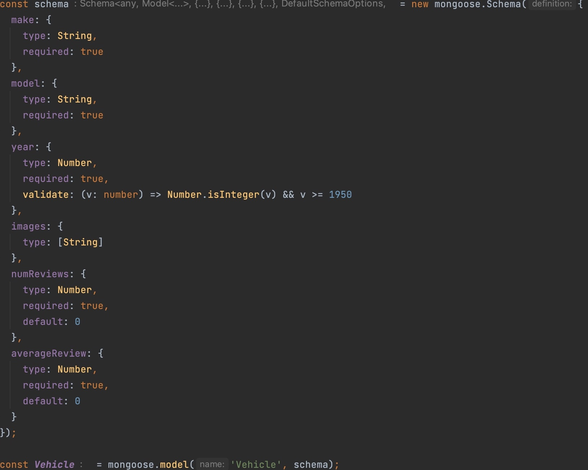

# typescript-express-reviews

This sample demonstrates integrating stargate-mongoose with [`express`](https://www.npmjs.com/package/express).




## 📋 How to

- [01. Create Astra Account](#-1---create-your-datastax-astra-account)
- [02. Create Astra Token](#-2---create-an-astra-token)
- [03. Create a Database](#-3---create-a-database)
- [04. Setup and Run project](#-4---setup-and-run-project)


#### ✅ `1` - Create your DataStax Astra account

> ℹ️ Account creation tutorial is available in [awesome astra](https://awesome-astra.github.io/docs/pages/astra/create-account/)

_click the image below or go to [https://astra.datastax./com](bit.ly/3QxhO6t)_

<a href="bit.ly/3QxhO6t">

</a>


#### ✅ `2` - Create an Astra Token

> ℹ️ Token creation tutorial is available in [awesome astra](https://awesome-astra.github.io/docs/pages/astra/create-token/#c-procedure)

- `Locate ` Settings ` (#1) in the menu on the left, then `Token Management` (#2)

- Select the role `Organization Administrator` before clicking `[Generate Token]`


The Token is in fact three separate strings: a `Client ID`, a `Client Secret` and the `token` proper. You will need some of these strings to access the database, depending on the type of access you plan. Although the Client ID, strictly speaking, is not a secret, you should regard this whole object as a secret and make sure not to share it inadvertently (e.g. committing it to a Git repository) as it grants access to your databases.

```json
{
  "ClientId": "ROkiiDZdvPOvHRSgoZtyAapp",
  "ClientSecret": "fakedfaked",
  "Token":"AstraCS:fake"
}
```

#### ✅ `3` - Create a Database

If you are creating a new account, you will be brought to the DB-creation form directly.

Otherwise, get to the databases dashboard (by clicking on Databases in the left-hand navigation bar, expanding it if necessary), and click the `[Create Database]` button on the right.


Take a moment to fill the form:

- **ℹ️ Fields Description**

| Field                                      | Description                                                                                                                                                                                                                                    |
|--------------------------------------------|------------------------------------------------------------------------------------------------------------------------------------------------------------------------------------------------------------------------------------------------|
| **Vector Database vs Serverless Database** | `PICK VECTOR` In june 2023, Cassandra introduced the support of vector search to enable Generative AI use cases. You might consume your credit faster with a vector database.                                                                  |
| **database name**                          | It does not need to be unique, is not used to initialize a connection, and is only a label (keep it between 2 and 50 characters). It is recommended to have a database for each of your applications. The free tier is limited to 5 databases. |
| **keyspace**                               | No requirement                                                                                                                                                                                                                                 |
| **Cloud Provider**                         | Choose whatever you like. Click a cloud provider logo, pick an Area in the list and finally pick a region. We recommend choosing a region that is closest to you to reduce latency. In free tier, there is very little difference.             |


#### ✅ `4` - Setup and Run project

detailed instructions in [typescript-express-reviews README](typescript-express-reviews/README.md)